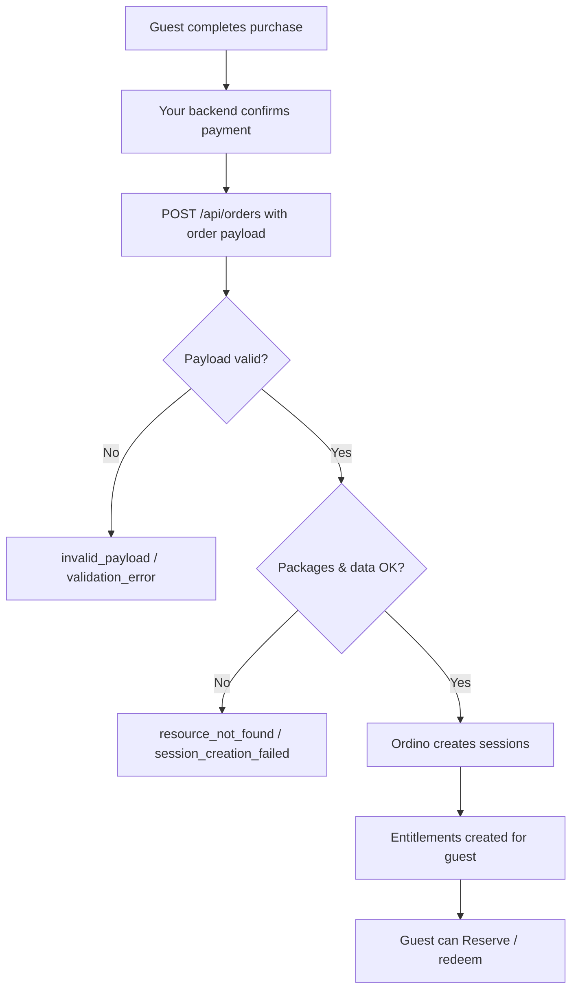

## Overview

This guide describes how to send order data from your e-commerce or payment system to Ordino using the **`/api/orders`** endpoint. When a guest completes a purchase in your store, your backend calls this API with the order details. Ordino creates the corresponding entitlements for that guest. Those entitlements then appear in the guest’s account and can be used for the [Reserve flow](user-interactions.md) (reservations, redemptions, etc.).

Calls to `/api/orders` are **server-to-server**. Use [API key authentication](authentication.md) (machine-to-machine); do not call this endpoint from the browser or a mobile app.

---

## Prerequisites

### Package configuration in Ordino

- **Package IDs** identify products in Ordino (similar to how `queue_id` identifies attractions). They are provided and managed by Ordino for your park/environment.
- Your store’s products or SKUs must be **mapped to these package IDs**. Every line item or product in the order payload must reference a valid package ID that exists in the park configuration.
- Package configuration in Ordino must match what you sell. If the order references a package ID that does not exist, Ordino returns [`resource_not_found`](errors/resource_not_found.md).

---

## Using `/api/orders`

### When to call

Call `POST /api/orders` from your backend **after** a guest has successfully completed a purchase (e.g. payment confirmed in your web store, app, or POS). Send one request per order with the full order payload. Ordino will create entitlements from that order for the guest.

### Authentication

Use the **API key** (machine-to-machine) method. Include the `x-api-key` header on every request. See [API Authentication](authentication.md).

### Example request

```http
POST /api/orders HTTP/1.1
Host: sb1-test-park.dev.ordino.global
x-api-key: YOUR_API_KEY_HERE
Content-Type: application/json
Accept: application/json

{
  "guest_email": "guest@example.com",
  "packages": [
    { "package_id": "pkg_ride_pass", "quantity": 1 },
    { "package_id": "pkg_voucher", "quantity": 2 }
  ],
  "metadata": {
    "order_id": "ord_shop_abc123",
    "reference": "WEB-12345",
    "source": "web_store",
    "total_amount": 49.99
  }
}
```

Replace the host with your park base URL (e.g. `{park_id}.dev.ordino.global`) and `YOUR_API_KEY_HERE` with your API key. Field names and structure must match the [API Reference](api.html); the example shows the typical requirements:

**Request body fields:**

- **`guest_email`** (required) — The identity of the guest who owns the order. Ordino attaches the created entitlements to this guest (1–256 characters).  Their identity will be extracted from the JWT token passed to authenticate, so this should
be a value that can be extracted from that JWT, whether it's email, userid, or something else entirely.
- **`packages`** (required) — One or more line items. Each item has **`package_id`** (required; Ordino package ID from your park configuration) and **`quantity`** (optional; integer 1–1000; defaults to 1 if omitted).
- **`metadata`** (optional) — Extra order context: **`order_id`** (your system’s order reference; useful for idempotency), **`reference`**, **`source`**, **`total_amount`** (numeric).
- **`redeemable_from`** / **`redeemable_until`** (optional) — ISO 8601 date-time; the window in which the order may be redeemed.
- **`max_redemptions`** (optional) — Integer 1–1000; how many times the order may be redeemed.

### Example success response

**Status:** `200 OK`

```json
{
  "success": true,
  "status": 200,
  "title": null,
  "detail": null,
  "trace_id": "00-abc123def456-00"
}
```

- **`success`** — `true` when the order was processed successfully.
- **`status`** — HTTP status code (200).
- **`trace_id`** — Unique identifier for the request (useful for support).

The guest’s new entitlements are available via `GET /api/entitlements` when they are authenticated.

### Example error response

When the payload is invalid (e.g. missing required fields or invalid package IDs), the API returns `400 Bad Request` with a problem-details body. Example (validation):

**Status:** `400 Bad Request`  
**Content-Type:** `application/problem+json`

```json
{
  "success": false,
  "status": 400,
  "error_code": "validation_error",
  "type": "https://commonpark-platform.dev.ordino.global/errors/validation_error",
  "title": "One or more validation errors occurred",
  "detail": "The request was unable to be completed due to a problem with the request.",
  "errors": {
    "Guest_email": ["The Guest_email field is required."],
    "Packages": ["At least one package is required."]
  }
}
```

If one or more package IDs do not exist in the park configuration, you receive [`resource_not_found`](errors/resource_not_found.md) with `resource_type: "package"` and `missing_resources` listing the invalid IDs.

### Request body requirements

- The body must be **valid JSON** that matches the schema expected by `POST /api/orders`. If the body is missing, malformed, or does not match the schema, Ordino may return [`validation_error`](errors/validation_error.md).
- **`guest_email`** and **`packages`** are required. `packages` must have at least one item; each item must include **`package_id`** (and optionally **`quantity`**). Each package ID must exist in the park configuration.
- Use **`metadata.order_id`** (or similar) for your own order reference and idempotency when retrying.

For the full request schema, see the [API Reference](api.html).

---

## Integration flow



1. **Guest completes purchase** — The guest pays in your store; your system records the order and the items (products) purchased.
2. **Your backend calls Ordino** — After payment is confirmed, your server sends `POST /api/orders` with the order payload (package IDs, guest identifier, etc.) and your API key.
3. **Ordino processes the order** — Ordino validates the payload and creates sessions from the order. Each valid line item (package ID) results in the corresponding entitlements for the guest.
4. **Result** — The guest’s entitlements are available via `GET /api/entitlements` (in end-user context with a Bearer token), and they can use the [Reserve and redemption flow](user-interactions.md).

---

## Error handling

| Error | Meaning | What to do |
|-------|--------|------------|
| [`validation_error`](errors/validation_error.md) | Request body failed validation (e.g. missing required fields, invalid structure). | Fix the payload per the API schema and validation rules. |
| [`resource_not_found`](errors/resource_not_found.md) | One or more package IDs in the order do not exist. | Use package IDs that exist in the park configuration; fix mapping and retry. |

---

## Security and best practices

- **Use HTTPS** — Always call the API over HTTPS; never send the API key over plain HTTP.
- **Keep the API key on the server** — Call `/api/orders` only from your backend. Store the API key in a secrets manager or secure environment variables; never embed it in client-side code or mobile apps.
- **Idempotency** — If you retry after a timeout or partial failure, use the same order identifier (if the API supports it) so Ordino can avoid creating duplicate entitlements. See the [API Reference](api.html) for idempotency behaviour.

---

## Relation to Reserve and entitlements

Once orders are successfully submitted via `POST /api/orders`:

- The guest’s entitlements are available to **`GET /api/entitlements`** when the guest is authenticated (end-user context with a Bearer token).
- The guest can **reserve** using [User Interactions — Reserve & Entitlements](user-interactions.md): select entitlements and call `POST /api/sessions/actions/reserve` with the chosen `queue_id` and `entitlement_id`s.
- If the guest has no entitlements (`total = 0`), your app can direct them to your store; after they purchase and you call `POST /api/orders`, they will have entitlements on the next entitlements check.

For end-user API calls (entitlements, reservations), use **Bearer token** authentication as described in [API Authentication](authentication.md).
