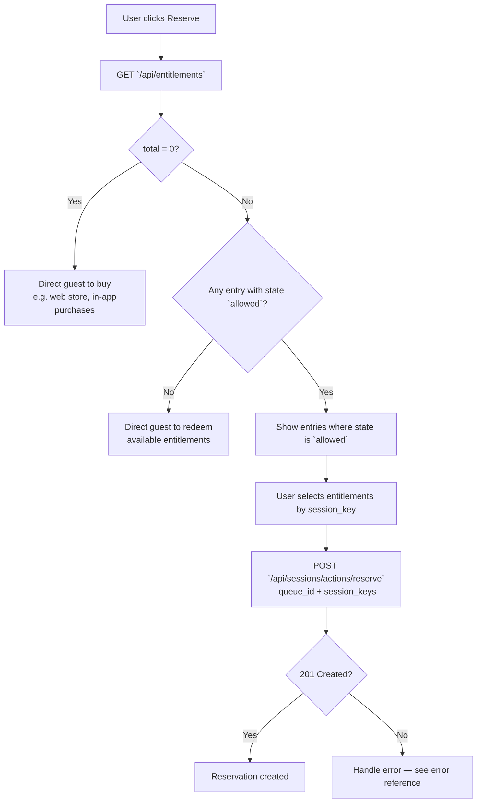

## Overview

This guide describes how to implement the **Reserve** flow for attractions: checking entitlements, guiding the guest when they have none or need to redeem, and creating reservations using the Ordino API. It also covers how to fetch and display a guest’s existing reservations.

All API calls in this flow must be made in the **end-user context** using a Bearer token. See [API Authentication](authentication.md) for details. Request and response shapes match the [Common Park API](https://registry.scalar.com/@ordino/apis/commonpark-api@latest) OpenAPI spec.

---

## Prerequisites

### CMS configuration

- Configure your CMS so that each attraction that supports reservation has a **`queue_id`**.
- `queue_id` values are provided by Ordino and identify the virtual queue (attraction) in the system.
- Use these `queue_id` values when calling the reservation and entitlements APIs.

### Reserve button

- Each attraction interaction screen should expose a **Reserve** button (or equivalent action).
- When the user taps or clicks **Reserve**, the app should follow the flow below.

---

## Reserve flow

The flow has three main steps:

1. **Check entitlements** — Call `/api/entitlements` to see what the guest can use.
2. **Handle the result** — Either direct the guest to purchase/redeem, or let them choose which entitlements to use.
3. **Create a reservation** — Call `/api/sessions/actions/reserve` with the chosen `queue_id` and **`session_key`**s from the selected entitlements.

### Flow diagram



#### Loading and errors

- **Loading:** While calling `/api/entitlements` or `/api/sessions/actions/reserve`, disable the Reserve button (or equivalent) and show a loading indicator (e.g. spinner or skeleton) so the guest knows the app is working. Avoid letting them submit again before the request finishes.
- **Errors:** If the API returns an error (e.g. 4xx or 5xx), show the message to the user (toast, banner, or inline), using the response `title` or `detail` if available. Offer a **“Try again”** action where it makes sense, and a way to get help (e.g. **“Contact support”**) for repeated or unclear failures. See the error reference for specific error codes and handling.

### Step 1: Call `/api/entitlements`

When the user clicks **Reserve**, the application should call the entitlements endpoint to see what the guest has available (e.g. passes, vouchers, session credits). You can optionally pass `queue_id` as a query parameter to filter entitlements for that attraction.

**Example request:**

```http
GET /api/entitlements?queue_id=queue_roller_coaster_01 HTTP/1.1
Host: {park_id}.dev.ordino.global
Authorization: Bearer <user_access_token>
Accept: application/json
```

**Example response (200 OK) — guest has entitlements; some are `allowed` for this queue:**

```json
{
  "success": true,
  "total": 2,
  "count": 2,
  "page": 1,
  "page_size": 10,
  "items": [
    {
      "session_key": "sk_abc123xyz",
      "state": "allowed",
      "can_reserve": true,
      "queue_id": "queue_roller_coaster_01",
      "reservation_type": "parallel",
      "total_count": 5,
      "remaining_count": 3,
      "available_after": null,
      "metadata": {
        "package_id": "pkg_ride_pass",
        "package_name": "Single Ride Pass",
        "locator_code": "LOC-001",
        "nickname": null,
        "user_id": null
      },
      "reservation": null
    },
    {
      "session_key": "sk_def456uvw",
      "state": "not_allowed_on_queue",
      "can_reserve": false,
      "queue_id": "queue_roller_coaster_01",
      "reservation_type": "parallel",
      "total_count": 5,
      "remaining_count": 5,
      "available_after": null,
      "metadata": {
        "package_id": "pkg_other_ride",
        "package_name": "Other Ride Pass",
        "locator_code": "LOC-001",
        "nickname": null,
        "user_id": null
      },
      "reservation": null
    }
  ]
}
```

**Example response (200 OK) — no entitlements (`total = 0`):**

```json
{
  "success": true,
  "total": 0,
  "count": 0,
  "page": 1,
  "page_size": 10,
  "items": []
}
```

**Example response (200 OK) — entitlements exist but none are `allowed` (e.g. need to buy something or choose another queue):**

```json
{
  "success": true,
  "total": 1,
  "count": 1,
  "page": 1,
  "page_size": 10,
  "items": [
    {
      "session_key": "sk_xyz789",
      "state": "not_allowed_on_queue",
      "can_reserve": false,
      "queue_id": null,
      "reservation_type": null,
      "total_count": null,
      "remaining_count": null,
      "available_after": "2025-03-14T09:00:00Z",
      "metadata": {
        "package_id": "pkg_voucher",
        "package_name": "Ride Voucher",
        "locator_code": "LOC-002",
        "nickname": null,
        "user_id": null
      },
      "reservation": null
    }
  ]
}
```

Use `total` and each item’s **`state`** and **`can_reserve`** to branch as in Step 2. Only entries with `state: "allowed"` and `can_reserve: true` can be used for the reserve call; use their **`session_key`** in the request.

### Step 2: Handle the entitlements result

Branch on the response:

| Condition | Action |
|-----------|--------|
| **No entries** (`total = 0` or `items` empty) | Direct the guest to **purchase** something (e.g. link to web store, in-app purchases, or ticket booth). |
| **No entries with `state: "allowed"`** | Direct the guest to **purchase** something or **redeem** their available entitlements before they can reserve (e.g. “Redeem your pass” or “Activate your voucher”), or they may need to wait until `available_after`. |
| **Some entries with `state: "allowed"` and `can_reserve: true`** | Let the guest select which one(s) to use and collect their **`session_key`** values for the reserve call. |

#### UX examples by outcome

- **No entitlements (`total = 0`)**  
  - Headline: e.g. **"You need access to reserve"**.  
  - Body: e.g. **"Get a pass or ticket to book a time for this attraction."**  
  - Primary CTA: e.g. **"Get access"** or **"Buy now"** — link to your web store, in-app purchases, or ticket booth.

  

- **Entitlements but none allowed**  
  - Headline: e.g. **"You can’t use these here yet"**.  
  - Body: explain that they must redeem or activate their pass/voucher first, or wait if `available_after` is set (e.g. **"This pass becomes valid for this ride on [date/time]."**).  
  - CTAs: e.g. **"Redeem"** or **"Activate"** (to your redemption flow), and optionally **"Buy more"** or **"See other rides"**.

- **Some entries with `state: "allowed"`**  
  - Show only items where `state` is `allowed` and `can_reserve` is `true`.  
  - For each entry, display: **package name** (e.g. `metadata.package_name`), and **remaining uses** if relevant (e.g. **"3 of 5 left"** from `remaining_count` / `total_count`).  
  - Let the guest pick one or more (depending on your rules); collect the **`session_key`** for each selected item.  
  - Primary action: e.g. **"Reserve with this"** or **"Book my spot"** — then call the reserve API with the chosen `session_key`(s).

  

### Step 3: Call `/api/sessions/actions/reserve`

After the guest has selected which entitlements to use, call the reserve endpoint with:

- The **`queue_id`** for the attraction.
- The **`session_keys`** from the selected entitlement items (each item’s `session_key`).

**Example request:**

```http
POST /api/sessions/actions/reserve HTTP/1.1
Host: {park_id}.dev.ordino.global
Authorization: Bearer <user_access_token>
Content-Type: application/json
Accept: application/json

{
  "queue_id": "queue_roller_coaster_01",
  "session_keys": ["sk_abc123xyz"]
}
```

Optional body field: **`reservation_type`** — one of `parallel`, `premium`, `time_bank`, `reverse` (if not provided, the API uses ~~the default for the entitlement~~`parallel`).

**Example response (201 Created):**

```http
Content-Type: application/json
Location: https://{park_id}.dev.ordino.global/api/reservations/r_123dhjgh

{
  "success": true,
  "title": null,
  "detail": null,
  "trace_id": "trace_abc123",
  "status": 201,
}
```

**Success UX:** After a 201, show a short confirmation (e.g. **"You’re reserved"** or **"Spot reserved"**) and either a **"View reservation"** link (to the reservation detail or list) or return the user to the attraction screen with the reservation state updated (e.g. show **"You have a reservation"** and the new reservation in the list). Use `GET /api/reservations` to fetch and display the new reservation (see below).

---

## Displaying reservations

### Fetching the list of reservations

Call the reservations endpoint to get the list of reservations for the current user. Responses are paginated and use **`items`** for the list (see [API Reference](api.html) for full schema).

**All reservations:**

```http
GET /api/reservations HTTP/1.1
Host: {park_id}.dev.ordino.global
Authorization: Bearer <user_access_token>
Accept: application/json
```

**Example response (200 OK):**

```json
{
  "success": true,
  "total": 2,
  "count": 2,
  "page": 1,
  "page_size": 10,
  "items": [
    {
      "reservation_id": "res_7f3a2b1c",
      "url": "https://{park_id}.dev.ordino.global/api/reservations/res_7f3a2b1c",
      "queue_id": "queue_roller_coaster_01",
      "queue_name": "Thunder Coaster",
      "queue_url": "https://{park_id}.dev.ordino.global/api/queues/queue_roller_coaster_01",
      "reservation_type": "parallel",
      "status": "ready",
      "state": "ready",
      "wait_time_at_reservation": 30,
      "remaining_wait_time": 0,
      "ready_at": "2025-03-13T15:00:00Z",
      "cancel_url": "https://{park_id}.dev.ordino.global/api/reservations/res_7f3a2b1c",
      "token": "tk_abc123",
      "token_url": "https://{park_id}.dev.ordino.global/api/reservations/res_7f3a2b1c/token",
      "members": [
        {
          "user_id": null,
          "session_id": "sess_xyz",
          "url": "https://{park_id}.dev.ordino.global/api/sessions/sess_xyz"
        }
      ]
    },
    {
      "reservation_id": "res_9d4e5f6g",
      "url": "https://{park_id}.dev.ordino.global/api/reservations/res_9d4e5f6g",
      "queue_id": "queue_water_ride_02",
      "queue_name": "Splash Falls",
      "queue_url": "https://{park_id}.dev.ordino.global/api/queues/queue_water_ride_02",
      "reservation_type": "parallel",
      "status": "waiting",
      "state": "waiting",
      "wait_time_at_reservation": 45,
      "remaining_wait_time": 20,
      "ready_at": "2025-03-13T16:30:00Z",
      "cancel_url": "https://{park_id}.dev.ordino.global/api/reservations/res_9d4e5f6g",
      "token": "tk_def456",
      "token_url": "https://{park_id}.dev.ordino.global/api/reservations/res_9d4e5f6g/token",
      "members": []
    }
  ]
}
```

Reservation **`state`** values: `waiting`, `paused`, `canceled`, `expired`, `ready`, `completed`.

**Reservations for a specific attraction (filtered by `queue_id`):**

```http
GET /api/reservations?filter=queue_id:queue_roller_coaster_01 HTTP/1.1
Host: {park_id}.dev.ordino.global
Authorization: Bearer <user_access_token>
Accept: application/json
```

Replace `queue_roller_coaster_01` with the attraction’s `queue_id` from your CMS.

**Example response (200 OK) — filtered to one attraction:**

```json
{
  "success": true,
  "total": 2,
  "filtered_count": 1,
  "count": 1,
  "page": 1,
  "page_size": 10,
  "items": [
    {
      "reservation_id": "res_7f3a2b1c",
      "url": "https://{park_id}.dev.ordino.global/api/reservations/res_7f3a2b1c",
      "queue_id": "queue_roller_coaster_01",
      "queue_name": "Thunder Coaster",
      "queue_url": "https://{park_id}.dev.ordino.global/api/queues/queue_roller_coaster_01",
      "reservation_type": "parallel",
      "status": "ready",
      "state": "ready",
      "wait_time_at_reservation": 30,
      "remaining_wait_time": 0,
      "ready_at": "2025-03-13T15:00:00Z",
      "cancel_url": "https://{park_id}.dev.ordino.global/api/reservations/res_7f3a2b1c",
      "token": "tk_abc123",
      "token_url": "https://{park_id}.dev.ordino.global/api/reservations/res_7f3a2b1c/token",
      "members": []
    }
  ]
}
```

### Where to show reservations in the app

- **Per-attraction screen** — Use `GET /api/reservations?filter=queue_id:<queue_id>` and display that attraction’s reservations (e.g. “Your reservations for this ride”).
- **Global list** — Use `GET /api/reservations` (no filter) and show all of the guest’s reservations in a central place (e.g. “My reservations” or “My day” screen).

You can combine both: a global list plus per-attraction filtered views for each ride or experience.

#### List and card UX

For each reservation in the list (or card), show:

- **Queue/attraction name** — e.g. `queue_name` (“Thunder Coaster”).
- **Status** — from `state`: e.g. **“Waiting”**, **“Ready”**, **“Completed”**, or **“Canceled”**.
- **Wait time** — when `state` is `waiting`, show **“About X min left”** using `remaining_wait_time` (or “Ready at [time]” using `ready_at`).
- **Ready at** — when relevant, show the time the reservation becomes ready (`ready_at`), e.g. **“Ready at 3:00 PM”**.
- **Cancel** — expose a **“Cancel reservation”** action that uses the reservation’s `cancel_url` (see API reference for the cancel method).

  

**Empty state:** When `items` is empty, show a short message such as **“No reservations yet”** with supporting copy (e.g. **“Reserve a time for an attraction to see it here.”**) and a CTA to browse or reserve if appropriate.

  
